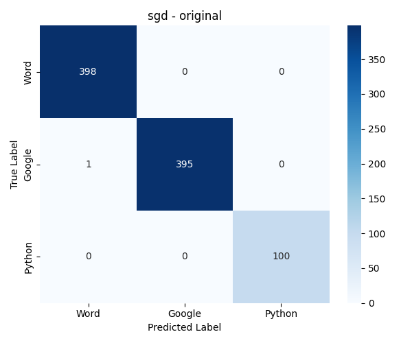
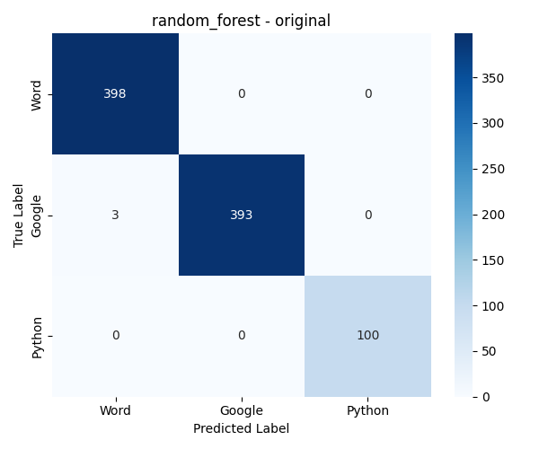
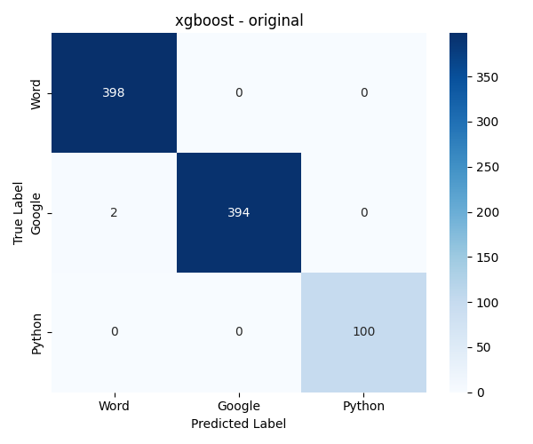
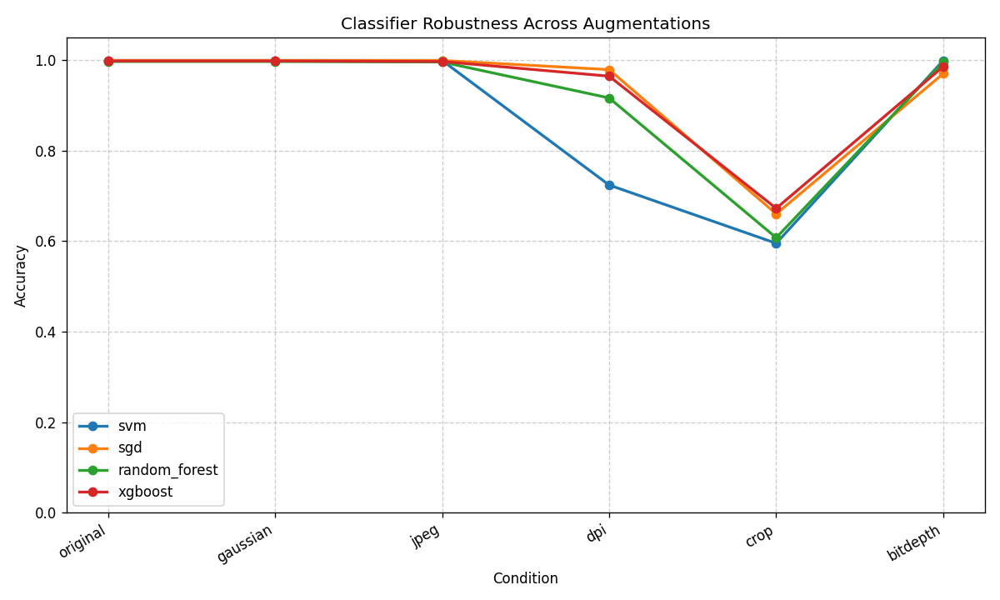
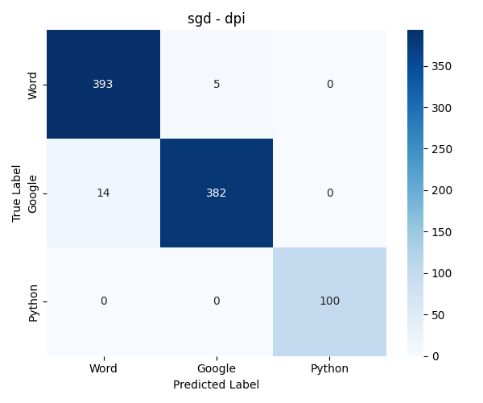
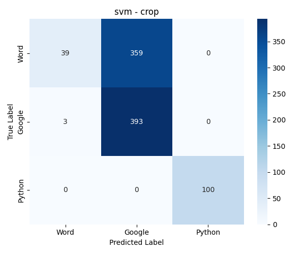
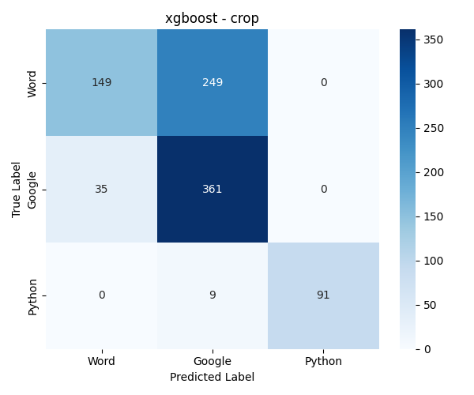

# ForensicsDetective: Hero or Zero?
## Augmentation and Robustness Testing for PDF Provenance Detection

**Aayush Nepal**
**EAS 510 — Basics of AI**
**March 2026**

---

## 1. Executive Summary

This report is about my work on extending the ForensicsDetective project for Assignment 2. The project does something really cool — it takes a PDF file, reads its raw bytes as pixel values, and builds a grayscale image from that. Then machine learning classifiers try to figure out what software originally created the PDF. Prof. Del Vecchio's Phase 1 work showed this approach hits 97.5-100% accuracy with SVM and SGD on a small test set.

What I did for this assignment was scale things up to the full 894-image dataset, add Random Forest and XGBoost as additional classifiers, and apply five different image augmentations to see how robust the classifiers actually are. The short version: they work amazingly well on clean images (like 99.9% accuracy), but they completely fall apart when you crop the images. Even removing just 1-3% off the borders tanks accuracy to around 60%, which was honestly surprising to see. More details on all of this below.

---

## 2. Background

### 2.1 What's the Problem?

In digital forensics there are situations where you need to know what software made a PDF. Usually people look at the metadata — the "Creator" field, XMP streams, that kind of thing. But the problem is that metadata is super easy to fake. Anyone can strip it or change it.

This project takes a completely different approach. Instead of looking at metadata, you read the raw bytes of the PDF file and use each byte value as a pixel intensity to make a grayscale image. Different PDF generators (Word, Google Docs, ReportLab) handle things like compression, fonts, and object serialization differently, so their binary output has different patterns. Those patterns show up visually in the images, and it turns out classifiers can learn to tell them apart.

### 2.2 Why Test Robustness?

The Phase 1 results were almost perfect, which is great but raises a natural question — how fragile is this? In a real forensic setting, documents might go through all kinds of processing: getting scanned, compressed for email, copied at low resolution, etc. If the classifiers break down under these conditions, the approach wouldn't be very practical.

That's basically what this assignment tests. I apply five kinds of distortions that simulate real-world scenarios and see how much the classifiers degrade.

---

## 3. Methodology

### 3.1 Dataset

The dataset was created by the professor and comes from 398 Wikipedia articles that were converted to PDFs through three different tools:

| Class | How it was made | Count |
|-------|----------------|-------|
| Word | Exported as PDF from Microsoft Word | 398 |
| Google | Downloaded as PDF from Google Docs | 396 |
| Python | Generated with Python's ReportLab library | 100 |
| **Total** | | **894** |

Each PDF was already converted to a grayscale binary image (provided in the repo). I resized all images to 200x200 pixels to get consistent 40,000-dimensional feature vectors.

The class sizes aren't perfectly balanced — the Python class only has 100 samples vs ~400 for the others. I used stratified splitting to keep the proportions consistent in train/test.

### 3.2 Preprocessing

Before training, I ran the features through two preprocessing steps:

1. **StandardScaler** — normalizes each pixel position to zero mean and unit variance. Without this, some positions with higher raw values would dominate the distance calculations.
2. **PCA** — reduces from 40,000 dimensions down to 100 principal components. This only captures 25.5% of the total variance, which sounds low, but makes sense given how high-entropy PDF binary data is. The important structural patterns are in those top components.

### 3.3 Augmentations

I applied five augmentations, each one independently to every original image. So each image gets 5 augmented copies, making the total dataset 6x the original (894 + 4,470 = 5,364 images).

| Augmentation | What it does | Real-world analog |
|-------------|-------------|-------------------|
| Gaussian Noise | Adds random noise, σ between 5-20 | Scanner sensor noise |
| JPEG Compression | Re-encodes at quality 20-80 | Email/web compression |
| DPI Downsampling | Scales down to 150 or 72 dpi then back up | Low-res scanning |
| Random Crop | Removes 1-3% from each border | Physical scan misalignment |
| Bit-Depth Reduction | Drops from 256 to 16 intensity levels | Low-quality hardware |

One thing worth noting — for DPI and cropping, I resize the image back to the original dimensions after the distortion. This is necessary because the classifiers expect a fixed-length feature vector (40,000 pixels = 200x200).

For the JPEG augmentation I save to actual JPEG format first (to get real quantization artifacts) then convert back to PNG for consistent loading.

### 3.4 Classifiers

I used the two baseline classifiers from Phase 1 plus two additional ones:

**Baseline (from Phase 1):**
- **SVM** — Support Vector Machine with RBF kernel, C=1.0. Good at finding non-linear boundaries.
- **SGD** — Stochastic Gradient Descent with logistic loss. It's basically just a fast linear classifier.

**The two I added:**
- **Random Forest** — Uses 100 decision trees that each train on a random subset of the data, then they take a majority vote. I picked this because it handles noise well and its pretty different from the linear methods.
- **XGBoost** — Gradient boosting, where trees are built one after another and each one tries to fix the mistakes of the ones before it. I chose this since it usually does well on structured/tabular type data like our flattened pixel vectors.

Important: all models are trained only on the original images (80/20 split, 715 train / 179 test). The augmented images are used purely for evaluation — this way the robustness results reflect actual domain shift, not just whether the model memorized the distortions.

---

## 4. Results

### 4.1 Baseline (Original Images)

On clean, unmodified images, all four classifiers do exceptionally well:

| Classifier | Accuracy | Precision | Recall | F1 |
|-----------|----------|-----------|--------|----|
| SVM | 99.89% | 99.92% | 99.92% | 99.92% |
| SGD | 99.89% | 99.92% | 99.92% | 99.92% |
| Random Forest | 99.66% | 99.75% | 99.75% | 99.75% |
| XGBoost | 99.78% | 99.83% | 99.83% | 99.83% |

The confusion matrices below show how clean the classifications are on original data — nearly perfect diagonal:

| | |
|---|---|
|  |  |
|  |  |

*Figure 1: Confusion matrices for all 4 classifiers on original (unaugmented) images.*

Honestly, these numbers are almost suspiciously good. The fact that even a simple linear model (SGD) hits 99.89% tells me the class boundaries in PCA space are very clean. The PDF generators really do leave distinct binary fingerprints.

### 4.2 Robustness Results

Here's where it gets interesting:

| Condition | SVM | SGD | Random Forest | XGBoost |
|-----------|-----|-----|---------------|---------|
| Original | 99.89% | 99.89% | 99.66% | 99.78% |
| Gaussian | 99.89% | 99.89% | 99.66% | 99.78% |
| JPEG | 99.89% | 99.89% | 99.55% | 99.66% |
| DPI | 72.37% | **97.87%** | 91.61% | 96.42% |
| Crop | 59.51% | 66.00% | 60.74% | 67.23% |
| Bit-depth | 99.89% | 96.98% | 99.55% | 98.55% |

The robustness curve below shows how each classifier's accuracy changes across conditions:

*Figure 2: Accuracy degradation across augmentation conditions. Note the sharp drop for DPI (especially SVM) and the universal collapse under cropping.*

### 4.3 What These Numbers Mean

**Gaussian noise and JPEG compression barely matter.** All classifiers handle them without any real degradation. The structural patterns in the binary images are strong enough that adding noise or compressing doesn't disrupt them. After PCA, the noise gets pushed into low-variance components that classifiers basically ignore.

**DPI downsampling hits SVM hard.** This was the most surprising result to me. SVM drops from 99.89% all the way to 72.37%, while SGD barely flinches (97.87%). The other classifiers fall somewhere in between.

I think what's happening is that DPI downsampling introduces systematic interpolation artifacts — pixels get averaged together during the downscale, then nearest-neighbor creates blocky patterns on the upscale. SVM with RBF kernel is really sensitive to how far data points are from the support vectors, and these systematic shifts push the data points across the decision boundary. SGD's linear surface seems more tolerant of this kind of uniform shift.

| | |
|---|---|
|  |  |

*Figure 3: DPI downsampling confusion matrices — SVM (left) shows heavy misclassification while SGD (right) stays mostly correct.*

**Cropping destroys everything.** This is the biggest finding. All four classifiers collapse:
- SVM: 99.89% → 59.51% (down 40 points)
- SGD: 99.89% → 66.00% (down 34 points)
- RF: 99.66% → 60.74% (down 39 points)
- XGBoost: 99.78% → 67.23% (down 33 points)

The reason is pretty clear when you think about it. The images are flattened into 1D vectors, so pixel position = array index. When you crop even 1-3% off the border and resize back up, every single pixel shifts position. The entire feature vector gets misaligned with what the classifiers learned. It's like sliding a ruler — everything shifts over.

The fact that accuracy stays above 59% (vs 33% random chance for 3 classes) means some signal survives, but it's really degraded.

| | |
|---|---|
|  |  |

*Figure 4: Cropping confusion matrices — SVM (left) and XGBoost (right) both show widespread misclassification across all classes.*

**Bit-depth reduction is mostly fine.** Dropping from 256 intensity levels to 16 doesn't affect SVM or RF much. SGD takes a small hit (96.98%) which might be because the linear weights depend more on fine intensity gradients.

### 4.4 Statistical Significance

I ran McNemar's test to compare each pair of classifiers on the original data:

| Model A | Model B | Statistic | p-value | Significant? |
|---------|---------|-----------|---------|-------------|
| SVM | SGD | 0.000 | 1.000 | No |
| SVM | RF | 0.500 | 0.480 | No |
| SVM | XGBoost | 0.000 | 1.000 | No |
| SGD | RF | 0.500 | 0.480 | No |
| SGD | XGBoost | 0.000 | 1.000 | No |
| RF | XGBoost | 0.000 | 1.000 | No |

None of the differences are statistically significant, which makes sense — when all classifiers are getting 99.7-99.9% accuracy, there are maybe 1-3 samples total where they disagree. McNemar's test just doesn't have enough disagreement events to work with at this accuracy level. It doesn't mean the classifiers are identical, just that you'd need a much bigger test set to detect the differences.

---

## 5. Discussion

### 5.1 Practical Implications

So the good news is that for documents that havent been through any physical processing (like scanning or printing), this approach works really well. JPEG compression and noise dont hurt it at all, which is nice because those are common things that happen when documents get emailed around or downloaded.

The bad news is that the whole approach kind of breaks down when spatial stuff changes. Because were flattening images into 1D vectors, cropping even a tiny amount messes up all the pixel positions and the classifiers cant handle it. In a real investigation you can't really guarantee that a document hasnt been cropped or scanned a little off-center, so thats a big limitation.

### 5.2 What Would Fix the Crop Problem?

I think the natural next step would be trying a CNN. The whole reason our classifiers break under cropping is because were treating images as flat 1D vectors where position matters. CNNs work on 2D patches and theyre designed to handle translation — a small shift or crop doesnt really change what the CNN sees. That should fix the biggest problem we found. It would be interesting to see if a simple CNN could maintain the 99%+ accuracy on clean images while also surviving cropping.

### 5.3 Classifier Recommendations

Based on the results:
- For clean documents: any of the four classifiers works, pick the fastest (SGD)
- For potentially scanned documents: avoid SVM, use SGD or XGBoost
- For potentially cropped documents: none of these classifiers are reliable, need a different approach (CNN)

---

## 6. Conclusion

To wrap up — I took the ForensicsDetective approach and scaled it to the full dataset (894 images, 3 classes), built a 6x augmented version (5,364 total), trained four classifiers, and tested everything.

The main things I found:
- On clean images all four classifiers get ~99.9% accuracy, which is honestly insane. The binary signatures are very real.
- Gaussian noise, JPEG compression, and bit-depth reduction dont really matter much. The classifiers handle them fine.
- DPI downsampling is interesting because it affects different classifiers differently. SVM tanks to 72% but SGD stays at 98%.
- Cropping breaks everything. All classifiers drop to 59-67% because the flattened feature vectors get misaligned.
- The McNemar tests show no significant differences between classifiers on clean data, but thats mostly because theyre all so accurate that theres basically no disagreement to test.

Overall the binary-to-image approach clearly works for PDF forensics when documents are clean, but the spatial robustness issue with cropping is a real problem that would need CNNs or some other 2D-aware approach to solve.

---

## 7. References

1. "Digital Forensics for Malware Classification: Binary Visualization Approach." Computational Intelligence and Neuroscience, 2022. https://pmc.ncbi.nlm.nih.gov/articles/PMC9050294/

2. "PDF Malware Detection Using Machine Learning." IEEE, 2024. https://ieeexplore.ieee.org/document/10412055/

3. "Analyzing PDFs like Binaries: Adversarially Robust PDF Malware Analysis." arXiv, 2025. https://arxiv.org/html/2506.17162

4. "PDF Forensic Analysis and XMP Metadata." Meridian Discovery. https://www.meridiandiscovery.com/articles/pdf-forensic-analysis-xmp-metadata/

5. Scikit-learn Documentation — SVM, SGD, Random Forest, PCA. https://scikit-learn.org/stable/

6. Chen & Guestrin, "XGBoost: A Scalable Tree Boosting System." KDD 2016. https://arxiv.org/abs/1603.02754

7. McNemar, Q. "Note on the sampling error of the difference between correlated proportions." Psychometrika, 1947.

8. "PDF Forensics and the Metadata Conundrum." PDF Association. https://pdfa.org/presentation/pdf-forensics-and-the-metadata-conundrum/
